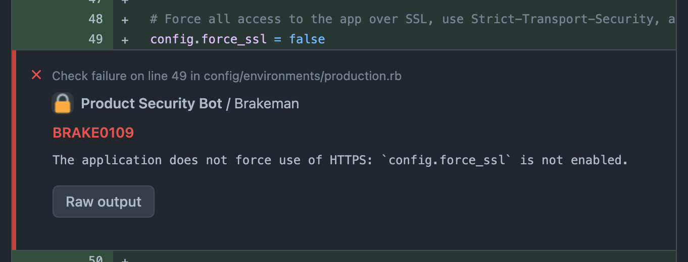
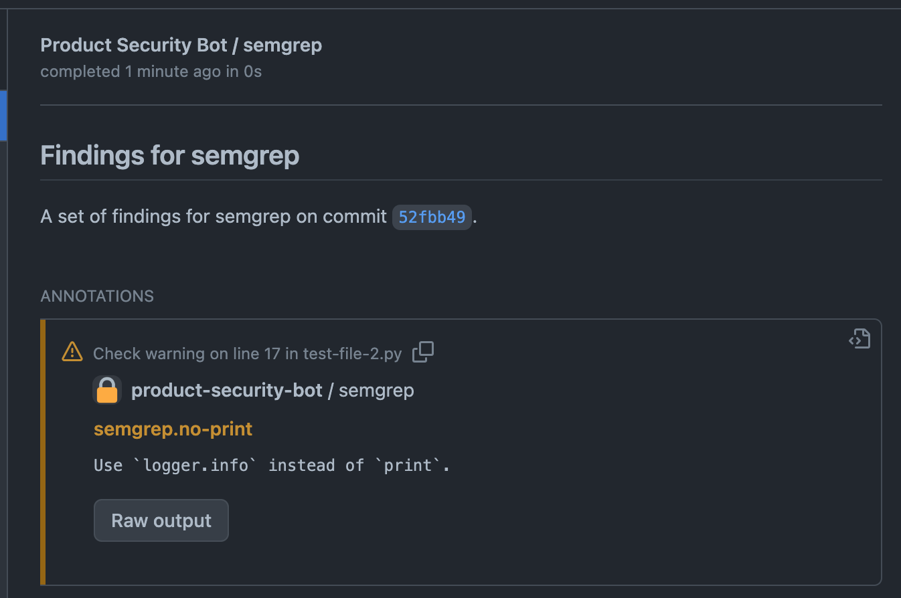

# Less Advanced Security

GitHub sells a product, [GitHub Advanced Security](https://docs.github.com/en/get-started/learning-about-github/about-github-advanced-security) which bundles CodeQL (a static analysis tool similar to [semgrep](https://semgrep.dev)), secret scanning (similar to [trufflehog](https://github.com/trufflesecurity/trufflehog)), an improved UI on dependency spec files, and [security overview](https://docs.github.com/en/code-security/security-overview/about-the-security-overview) (a way to upload static analysis findings such that they produce PR annotations, and a dashboard to view them).

Less Advanced Security is... less advanced. It enables you to bring-your-own PR annotations to any tool which outputs results in the [sarif format](https://github.com/microsoft/sarif-tutorials). Sarif support is currently limited to common fields used by tools like [`semgrep`](https://semgrep.dev) and [`brakeman`](https://brakemanscanner.org).

GitHub Advanced Security charges a per-active-commiter seat license of ~$600/yr. Less Advanced Security is free (bring your own compute, config, and maintenance).

## Sample Usage

### Code annotations

Annotations are added to the pull request file page marking the line(s) impacted. Annotations may be notices, warnings, or failures.




If a finding is reported multiple times in the input sarif (same file, lines, finding id, and level), `less-advanced-security` will deduplicate these and post only one annotation.

### Commit (and PR) status checks

A check is added to the commit (and pull request) denoting the status of the most severe annotation. Failures result in a failing check, warnings result in a pending check, notices result in a passing check.


### Finding summaries

All annotations are summarized on the PR's checks page.


## Setup

### GitHub Application

1. [Create a GitHub App](https://docs.github.com/en/developers/apps/building-github-apps/creating-a-github-app) for your user or org.
    * The `GitHub App name` will be visible when `less-advanced-security` runs. Choose something succinct.
    * Set `Homepage URL` will be visible on the checks page. Choose a useful doc for your org (or use this repo's URL).
    * Set `Webhook` to `Active`, but configure a nonsense URL (like `https://github.com/<your_user>/dev/null`) for the destination.
    * Set the following permissions:
        * `Repository permissions > Checks > Access: Read and write`
        * `Repository permissions > Pull requests > Access: Read-only`
    * For `Where can this GitHub App be installed?` select `Only on this account`.
    * Note the `App Id` for later.
1. [Generate a private key](https://docs.github.com/en/developers/apps/building-github-apps/authenticating-with-github-apps) and save it locally.
    * Note the path to the key for later.
1. [Install the GitHub App](https://docs.github.com/en/developers/apps/managing-github-apps/installing-github-apps), granting it access to the relevant repos.
    * Note the `installation.id` for later. To do this, return to your app configuration, look at `Advanced` settings, find the failed webhook delivery, and look at the payload.

### Installation

Builds of `less-advanced-security` are available for common platforms and architectures, likely including your CI environment.
Download and install the [latest release of `less-advanced-security`](https://github.com/eliblock/less-advanced-security/releases/latest) for your platform and architecture.

Confirm successful installation by reading the `--help` output:

```sh
less-advanced-security --help
```


## Usage

Run your sarif-producing scan, writing the sarif file to disk.

Then run
```sh
less-advanced-security --app_id=<app_id> --install_id=<installation_id> --key_path=<path_to_key> --sha=<sha_of_target_commit> --repo=<repo_owner>/<repo_name> --pr=<pr_number> --sarif_path=<path_to_sarif_file>
```

For example:

```sh
less-advanced-security --app_id=12345 --install_id=87654321 --key_path=tmp/application_private_key.pem --sha=ee5dabb638b6b874c42bc3c915cf94d4b6b346b6 --repo=eliblock/less-advanced-security --pr=57 --sarif_path=/tmp/scan-results/sarif.json
```

### Configuration

#### `--filter_annotations`
Defaults to `True` (disable with `--filter_annotations=false`).

When set to `True`, annotations are added only when they apply to a line modified in the pull request (or a line immediately around it based on the git patch). When set to `False`, all annotations are added regardless of file or line.

#### `--annotate_beginning`
Defaults to `True` (disable with `--annotate_beginning=false`).

When set to `True`, annotations are submitted for the start line of a finding only (rather than the full range of lines in the finding). With this set to `False`, GitHub's default of displaying annotations on the end line of a finding is used.

#### `--check_name`
Defaults to the tool driver name from the submitted sarif (override with `--check_name "Override name of check"`).

When set to any string, the GitHub check is named that string (rather than the name of the tool which reported the results). Use this configuration in the event that the same tool powers multiple checks on your PR.

## Development

### Environment

```sh
brew install go@1.19
go build ./...
go test -v ./...
```

### Release

```sh
brew install goreleaser
git tag v0.1.0 # update for your version
git push origin v0.1.0 # update for your version
goreleaser release --clean --snapshot # remove --snapshot for a full release
# complete the release on GitHub
```
